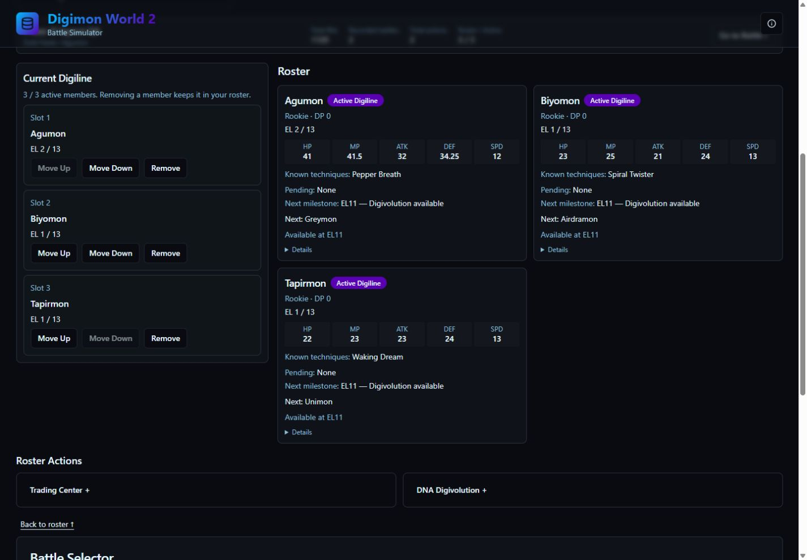
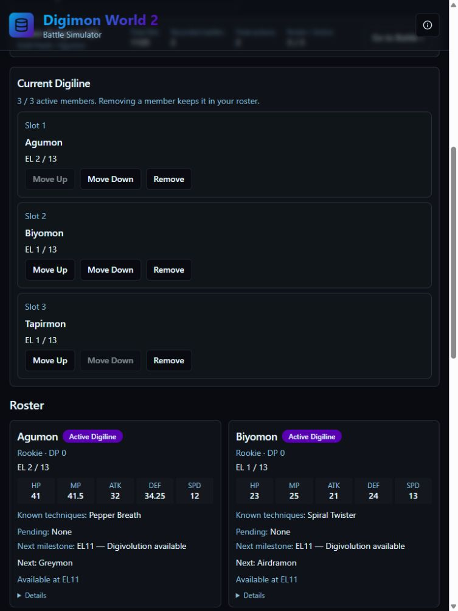
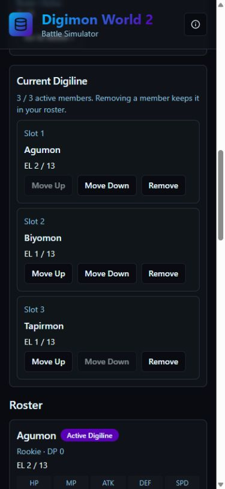
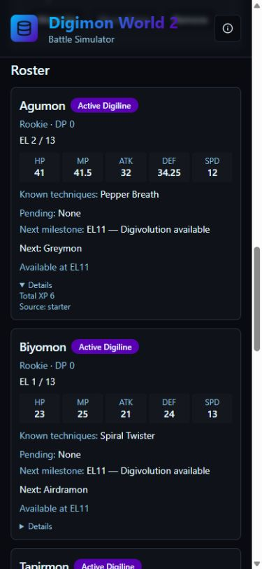

# Phase 2I-A — Run Planner UX and Layout

Implemented on `phase-2i-a-run-planner-layout`. No commit or push. Schema remains v7; gameplay, storage, event recording and replay implementations are unchanged.

## Files

Modified:

- `src/components/run-planner/RunPlanner.tsx`: compact summary, shared Digiline/roster workspace, card hierarchy, action placement and navigation anchors.
- `src/components/run-planner/RunHistory.tsx`: local collapse/filter state, compact history cards and original chronological numbering.
- `src/components/run-planner/TradeControls.tsx`: optional compact disclosure and explicit cancellation using the existing reset flow.
- `src/components/run-planner/DnaControls.tsx`: optional compact disclosure and explicit cancellation using the existing reset flow, including clearing local preview errors.
- `tests/runPlanner.test.cjs`: 24 focused UX tests added; existing assertions retained.

Created:

- `src/components/run-planner/ActionDisclosure.tsx`: accessible, mounted disclosure content that stays open during selection.
- `src/components/run-planner/TechniquePlanningSummary.tsx`: compact pending-technique presentation with expandable large pools.
- `src/utils/runPlanningDisplay.ts`: read-only milestone projection using existing eligibility and XP data helpers.
- This report and four screenshots in `docs/phase-2i-a/`.

## Layout and interactions

Desktop uses a responsive 1:2 grid at the existing `xl` breakpoint (1280px): approximately 33% Digiline and 67% roster. All three slots remain together in the left panel; roster cards use two columns. No Trade/DNA forms appear between the two panels. Below 1280px the panels stack. Roster cards use two columns from 768px and one column below that breakpoint.

Cards always show species, active/reserve status, rank, DP, level/cap, all five exact stats, known techniques, pending techniques, next milestone and the existing normal Digivolution summary/control. Total XP and acquisition source are under native Details disclosures. Common roster and Digivolution actions stay visible.

Pending entries sort by unlock level and stable technique key. Pools of up to three show names, levels and own/inherited origin directly; larger pools show a count and earliest threshold with expandable entries. Empty pools say None. Entries beyond the current cap, an unresolved cap or verified XP scope are explicitly qualified.

Next milestone chooses the earliest verified reachable technique event, normal Digivolution eligibility, MAX or cap-resolution threshold. Events at the same level appear together. Currently available Digivolution is shown separately. Eligibility comes from the existing normal Digivolution preview; no battle-count estimates or new XP formulas are introduced. XP beyond EL50 is not projected.

Trading Center and DNA Digivolution are collapsed by default in Roster Actions below the workspace. Content remains mounted. Selecting any trade/parent keeps its panel expanded and offers an explicit Cancel button. Failed confirmation retains selections. Successful actions use the existing reset flow. Panels are keyed by run identity, so unrelated action feedback does not discard ongoing selections; switching runs creates fresh panels. Existing stale snapshot checks still govern confirmation.

The compact run summary includes run name, original starter, Bits, recorded battles, total actions and roster/active counts. Go to Battle and Back to roster are native links to focusable regions with sticky-header clearance. Exactly one BattleSelector is mounted.

History supports All, Battles, Digivolution, DNA and Trades, plus collapse/expand. Filtering and collapse use local UI state only. Original chronological indices are attached before filtering. Undo remains outside the collapsed area and always captures the real latest event from the full history, including when the selected filter has no matches.

## Verification

| Check | Result |
| --- | --- |
| All Run Planner tests | **593/593**: original 569 plus 24 UX tests |
| Data self-checks | **46/46**, also rerun through the dedicated self-check test |
| App TypeScript | Pass: `npx tsc -p tsconfig.app.json --noEmit` |
| Node TypeScript | Pass: `npx tsc -p tsconfig.node.json --noEmit` |
| Production build | Pass: `npm run build` |
| Lint | Historical **7 errors / 7 warnings**, no new findings |
| Browser errors | None in captured error logs |
| Whitespace | `git diff --check` passed |

Full test command: `node --test tests/runPlanner.test.cjs tests/runPlannerHardening.test.cjs`.

The lint errors remain in `command.tsx`, `textarea.tsx`, `battleEngine.ts` and `tailwind.config.ts`; the seven existing Fast Refresh warnings remain in shared UI components. Build retains the existing large-bundle and outdated Browserslist-data warnings.

## Manual visual regression

Used an isolated production preview at `127.0.0.1:4179` and a new "Phase 2I layout QA" run. Acquired Biyomon and Tapirmon through normal battle/capture controls, then added both to the Digiline.

- **1440 × 1000 desktop:** all three populated Digiline slots and three roster cards visible together. Compact action rows fit below the workspace. Removed Biyomon, restored it from its adjacent roster card, and moved it back to Slot 2 without navigating through unrelated sections.
- **768 × 1024 tablet:** Digiline stacks above the roster; two readable roster columns. Active DNA selection survived resizing. Document width matched viewport content width (753px), with no horizontal overflow.
- **390 × 844 mobile:** single roster column; all slot controls usable. Expanded card Details exposed XP/source while essential planning information remained visible. Document width matched viewport content width (375px), with no horizontal overflow.
- Selected DNA Parent A and verified the disclosure stayed open until explicit cancellation. Selected a Trade on mobile and verified the same behavior and existing missing-species guard.
- Filtered History to Trades, collapsed it, and opened Undo: confirmation still correctly described the latest battle. Cancelled Undo; expanded History and verified the Trades filter was preserved. No action was undone.
- Verified Go to Battle focuses the single battle-recording region and Back to roster positions the workspace below the sticky header.
- Restored the temporary viewport override and stopped the preview server after verification.

Screenshots:

